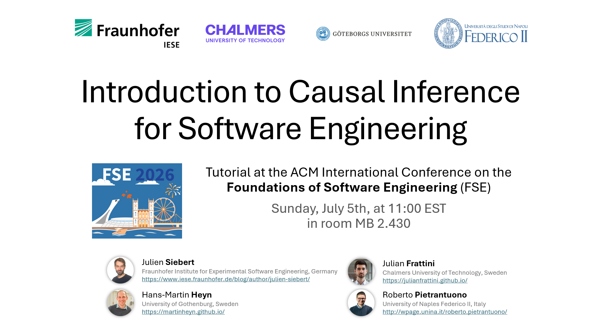

# CI4SE_Tutorial
Material for the Tutorial "Introduction to Causal Inference for Software Engineering" 

# Authors
Julien Siebert - Fraunhofer IESE
Julian Frattini - Chalmers University of Technology and Gothenburg University
Hans-Martin Heyn - Gothenburg University and Chalmers University of Technology
Roberto Pietrantuono - University of Naples Federico II
# Schedule of Tutorial at FSE'26
| Topic | Time | Slides |
|---|---|---|
| Introduction (material and exercises access). Motivation from a SE perspective. | 5 min | [Part 1](slides/Part%201%20Causal%20Modelling_intro_testing_RCA.pdf) |
| Modeling causal effects with causal graphs. Examples from SE research papers (most probably from domains such as Requirements Engineering, Testing and Fault Localization [5, 8, 10]). | 18 min | [Part 2](slides/Part%202%20Causal%20Modelling%20as%20RE%20activity.pdf) |
| Basic causal graphical structure and d-separation. | 17 min | [Part 3](slides/Part%203%20Basic%20Causal%20Structures%20and%20d-separation.pdf) |
| Break. | 10 min | |
| Identification, adjustment sets and conditional independencies. Exercises and application to previous SE examples. Link to DAGitty: [https://dagitty.net/](https://dagitty.net/)  | 20 min | [Part 4](slides/Part%204%20DAGitty%20Exercises.pdf) |
| Causal effect estimation and short overview in causal machine learning. | 10 min | [Part 5](slides/Part%205%20Causal%20Effect%20Estimation.pdf) |
| Conclusion: methods not explicitly relying upon graphs, counterfactual and mediation analysis, next steps in your causal journey with pointers to books, online Lectures and other reading material. | 10 min | Part 6 (coming soon) |
# Solutions to Exercises
* Problem 1: [https://dagitty.net/mDymjnHV9](https://dagitty.net/mDymjnHV9)
* Problem 2: [https://dagitty.net/mPxsokVRw](https://dagitty.net/mPxsokVRw)
* Problem 3a: [https://dagitty.net/mvzunz7xx](https://dagitty.net/mvzunz7xx)
* Problem 3b: [https://dagitty.net/m7RVrEEnA](https://dagitty.net/m7RVrEEnA)
* Problem 4: [https://dagitty.net/mFcJtc32s](https://dagitty.net/mFcJtc32s) 
# Reading materials
References in **bold** are especially suitable as starting points into the statistical causal inference journey.

* Cinelli, C., Forney, A., & Pearl, J. (2024). A crash course in good and bad controls. Sociological Methods & Research, 53(3), 1071–1104. https://doi.org/10.1177/00491241221099552
* Frattini, J., Torkar, R., Feldt, R., & Furia, C. A. (2026). Towards improving the external validity of software engineering experiments with transportability methods. arXiv. https://doi.org/10.48550/arXiv.2604.08200
* Giamattei, L., Guerriero, A., Pietrantuono, R., & Russo, S. (2025). Causal reasoning in software quality assurance: A systematic review. Information and Software Technology, 178, 107599. https://doi.org/10.1016/j.infsof.2024.107599
* **Huntington-Klein, N. (2021). The Effect: An Introduction to Research Design and Causality. Chapman and Hall/CRC. Free online: https://theeffectbook.net/**
* McElreath, R. (2020). Statistical Rethinking: A Bayesian Course with Examples in R and Stan (2nd ed.). Chapman and Hall/CRC. https://doi.org/10.1201/9780429029608
* **Pearl, J., Glymour, M., & Jewell, N. P. (2016). Causal Inference in Statistics: A Primer. Wiley. ISBN 978-1-119-18684-7.**
* **Pearl, J., & Mackenzie, D. (2018). The Book of Why: The New Science of Cause and Effect. Basic Books. ISBN 978-0-465-09760-9.**
* Rohrer, J. M. (2018). Thinking clearly about correlations and causation: Graphical causal models for observational data. Advances in Methods and Practices in Psychological Science, 1(1), 27–42. https://doi.org/10.1177/2515245917745629
* Siebert, J. (2023). Applications of statistical causal inference in software engineering. Information and Software Technology, 159, 107198. https://doi.org/10.1016/j.infsof.2023.107198
* Textor, J., van der Zander, B., Gilthorpe, M. S., Liśkiewicz, M., & Ellison, G. T. H. (2016). Robust causal inference using directed acyclic graphs: The R package 'dagitty'. International Journal of Epidemiology, 45(6), 1887–1894. https://doi.org/10.1093/ije/dyw341
